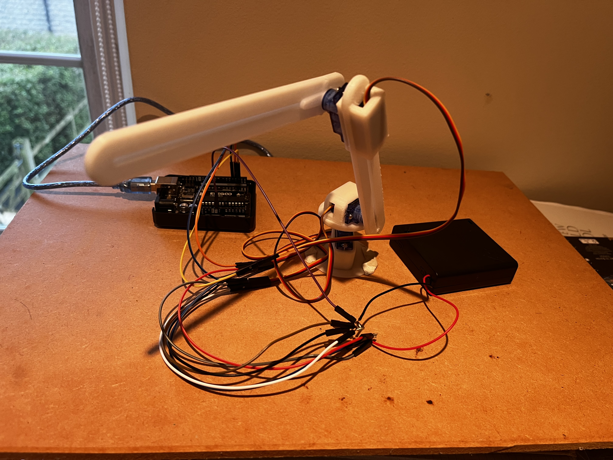
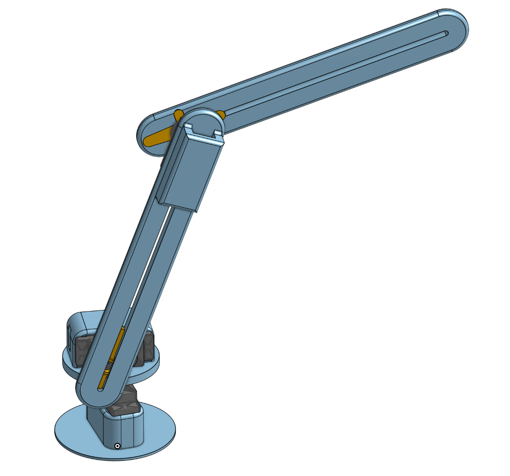

# Inverse Kinematics Robotic Arm

## Overview

This project documents the development of a 3 degrees of freedom robotic arm, from initial CAD design through physical construction and inverse kinematics-based control.

The goal was to design, build, and program a system capable of moving its end effector to a target position by computing the required joint angles. The repository captures the complete engineering process, combining mechanical design, hardware integration, and software implementation.

The rough working and step by step documentation can be viewed on the google slides link below

---

## Links

* google slide documenting process: https://docs.google.com/presentation/d/11Yj7fBU4LIVXhnzH5_TuppZ-_PNuySzZH2yjffFqX7w/edit?usp=sharing
* Onshape CAD file: https://cad.onshape.com/documents/37680dd26e3a28759b563309/w/ac908424e809403c105aca99/e/9a8b1e70a123fc365e53a634?renderMode=0&uiState=69f2589545160598825e1ce6

---

## Final Build

## Demo Video

[IK Demo Video](Videos/IK_Demo.MOV)

## CAD Model

---

## Features

* 3 DOF robotic arm design
* Real time control with keyboard
* Inverse kinematics for target coordinate positioning
* Physical build and assembly
* Visual / real-world demonstration of motion

---

## Design & Build

The mechanical structure of the arm was designed using Onshape CAD software, with consideration for joint movement, stability, range of motion, weight and material cost. The build process involved assembling the physical components and integrating actuators to enable controlled movement.

---

## Kinematics

The system uses inverse kinematics:

* **Inverse kinematics:** computes joint angles required to reach a target position.

The inverse kinematics implementation allows the arm to move toward specified coordinates, demonstrating the relationship between joint space and Cartesian space.

The servos used for this project were inexpensive and not fit for application, they only had speed control capabilities, were very low torque, seemed to operate at different speeds forward and backwards, and all operated at different speeds (despite being programmed to move at the same speed). This meant many software methods had to be employed to overcome the hardware shortage, mainly the calculation for the delay when the servo would be moving, such that it would move through a set angle, this involved linear interpolation and experimental timing results. Additionally the highest moment bearing servo varied in speed significantly when moving vertically, therefore a linearly interpolated constant was added to servo movement time based on calculated maximum moment of the device and current moment. 

---

## What I Learned

* Applying kinematic theory to a real system
* Bridging CAD design and physical construction
* Integrating hardware with control software
* Debugging real-world constraints vs theoretical models

---

## Future Improvements

* Increase degrees of freedom
* Improve positioning accuracy
* Add UI for real life control
* Use higher resolution actuators with built in angle and speed controllers
* Implement obstacle avoidance

---

## Reflections 

The final device works well in all three degrees of freedom, with only 180 degrees of operating area due to the algorithms limitations (unable to support negative values of x in arctan and arccos functions), future adaptations may include a ‘for’ command in the programme to account for negative x values.
The overall design is extremely light and allows for fast movement of the servos however it has limited strength for lifting objects. Additionally, the designs biggest flaw is that the motors are not precisely calibrated and therefore with multiple movements, error in the angle of each joint accumulates. To fix both of these issues, and updated device should use high torque 180 degree rotational servos rather than 360 degree continuous servos, this would require a higher voltage power supply and a redesign of the CAD model.
Moment calculations worked very well and fixed the issue of servo two stalling under load.

---

## License

This project is licensed under the MIT License.
